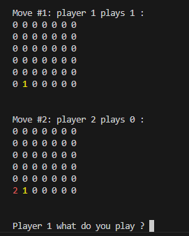
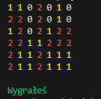
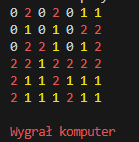

# **CONNECT4**

## Działająca wersja gry znajduje się w pliku OtherSideConnect4.py, który zawiera ostateczną implementację gry. 

*Plik Connect.py pozostawiliśmy jako dokumentację wcześniejszych etapów pracy nad projektem. Początkowo tworzyliśmy grę w tym pliku, jednak postanowiliśmy stworzyć ją na nowo - na podstawie tego co zostało już stworzone w Connect.py, zaczynając od podejścia AI.*

*Dlatego pliku Connect.py NIE TRZEBA URUCHAMIAĆ - JEST ON DO WGLĄDU JAK PRZEBIEGAŁA PRACA*

## Aby uruchomić OtherSideConnect4.py, należy:

- Pobrać pliki OtherSideConnect4.py oraz requirements.txt.

- Zainstalować wymagane biblioteki, korzystając z pliku requirements.txt. W tym celu używając poniższej komendy w terminalu:

pip install -r requirements.txt

Plik requirements.txt zawiera wszystkie potrzebne biblioteki, które są niezbędne do prawidłowego działania gry.

## Przykładowa rozgrwyka:

Dodawanie żetonu (ruch gracza):

Wygrana gracza (poziom i skos):

Wygrana AI:

