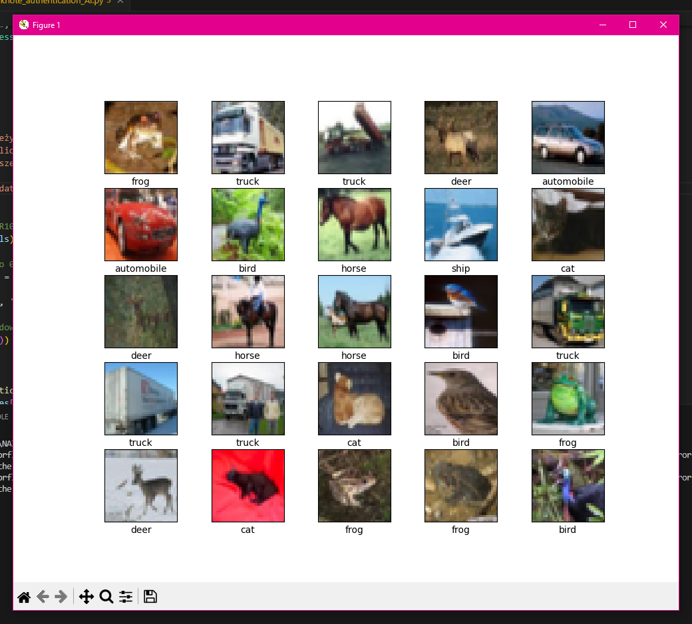
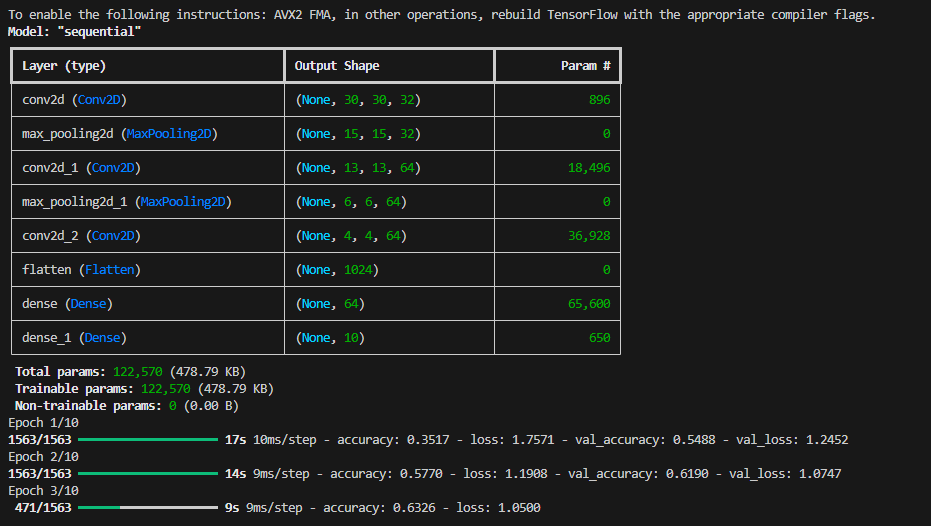
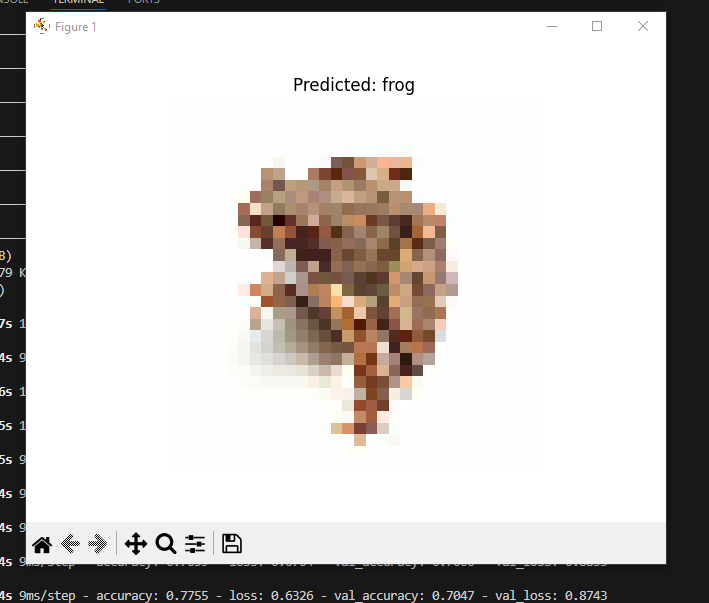
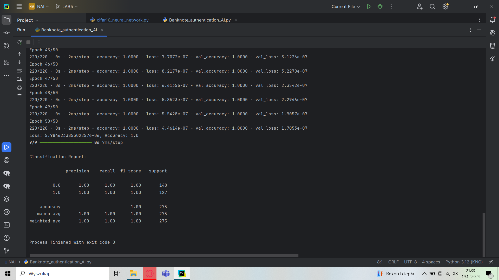
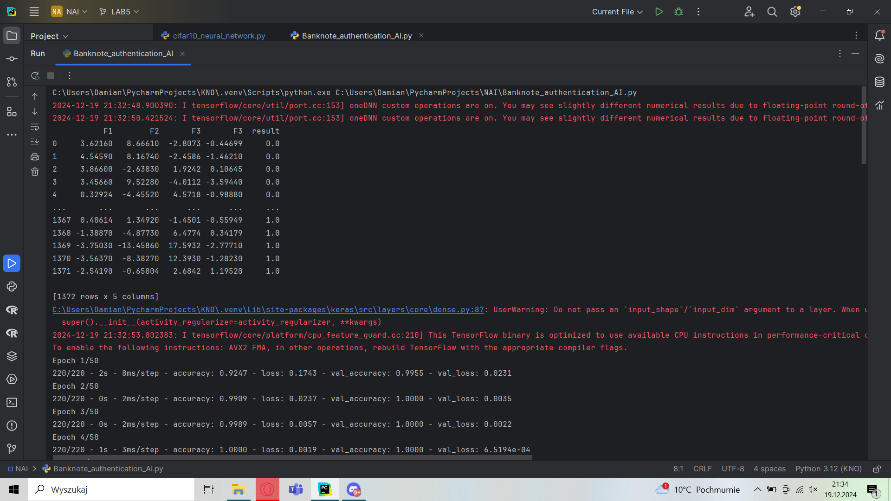

# URUCHOMIENIE

ABY URUCHOMIĆ PROGRAM NALEŻY:
Pobrać pliki znajdujące się na branchu LAB5.
Zainstalować wymagane biblioteki, korzystając z pliku requirements.txt. W tym celu używając poniższej komendy w terminalu:
pip install -r requirements.txt

Plik requirements.txt zawiera wszystkie potrzebne biblioteki, które są niezbędne do prawidłowego działania programu

# O PROJEKCIE

Projekt zawiera dwa oddzielne programy:

1) W projekcie klasyfikowane są obrazy z datasetu CIFAR10, zawierającego obrazy z różnych kategorii. Wykorzystywany jest model sieci neuronowej do automatycznego rozpoznawania i klasyfikowania obrazów podanych w programie.
2) Program tworzy, trenuje i ocenia model sieci neuronowej, którego celem jest klasyfikacja danych dotyczących autentyczności banknotów. Generuje raport wyników klasyfikacji.

# PRZYKŁADOWE WYWOŁANIE PROGRAMU CIFAR10

  

  

# PRZYKŁADOWE WYWOŁANIE PROGRAMU BANKNOTE AUTHENTICATION

  

