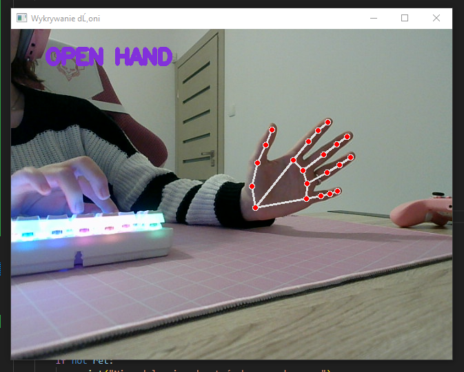
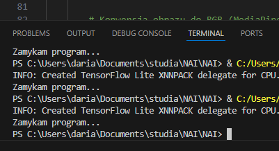
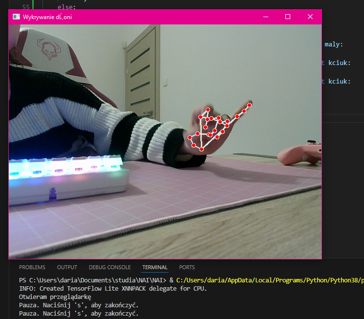
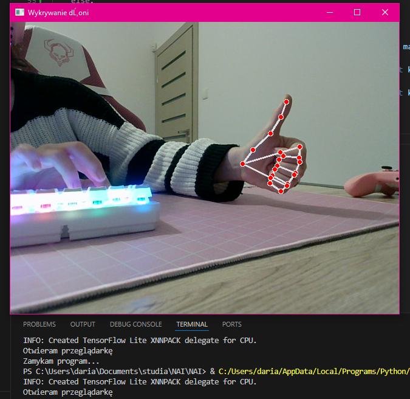

# URUCHOMIENIE

ABY URUCHOMIĆ PROGRAM NALEŻY: 

Pobrać pliki znajdujące się na repozytorium (branch LAb6). 

Zainstalować wymagane biblioteki, korzystając z pliku requirements.txt. 

W tym celu używając poniższej komendy w terminalu: pip install -r requirements.txt

# O PROJEKCIE

Program służy do rozpoznawania gestów dłoni za pomocą kamery. Wykorzystuje bibliotekę MediaPipe, przeznaczoną do przetwarzania obrazów i wideo, aby analizować pozycję kluczowych punktów na rękach i rozpoznawać pokazywane gesty. 
Program obsługuje następujące gesty:

<li> Mały palec (gest "Little finger up"): Pauza w programie, użytkownik może nacisnąć klawisz "s", aby kontynuować. </li>
<li> Duży palec (gest "Thumbs up"): Otwiera przeglądarkę internetową. </li>
<li> Palec wskazujący (gest "Index finger up"): Zamyka program.</li>
<li> Otwarta dłoń (gest "Open hand"): Wyświetla informację na ekranie o wykrytym geście "OPEN HAND".</li>

# PRZYKŁADOWE WYWOŁANIE PROGRAMU

## OTWARTA DŁOŃ - inforamcja   

## PALEC WSKAZUJĄCY - zamknięcie programu   

## MAŁY PALEC - zatrzymanie programu   

## KCIUK - otwarcie przeglądarki   

# WYKONANIE

Daria Szabłowska s24967
Damian Grzesiak s25866
