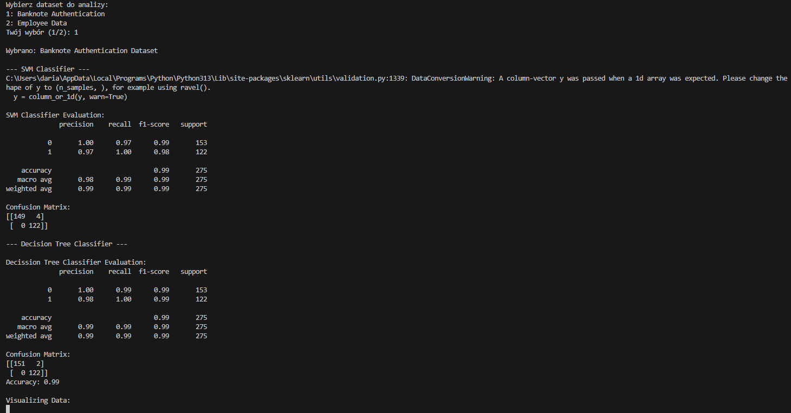

# URUCHOMIENIE

ABY URUCHOMIĆ PROGRAM NALEŻY: 

Pobrać pliki znajdujące się na repozytorium (branch LAB4). 

Zainstalować wymagane biblioteki, korzystając z pliku requirements.txt. 

W tym celu używając poniższej komendy w terminalu: pip install -r requirements.txt

# O PROJEKCIE

Projekt został wykonany na dwa sposoby:

- pierwszy - jest to w pełni wykonane zadanie, zawiera dwa datasety, klasyfikację za pomocą SVM oraz drzewa decyzyjnego wraz z wizualizacją - znajduje się w plikach: main.py, svcClassifier.py, decissionTreeClassifier.py 
  
Projekt klasyfikuje dane za pomocą dwóch różnych modeli uczenia maszynowego: 
maszyny wektorów nośnych (SVM) i drzewa decyzyjnego. Umożliwia użytkownikowi wybór 
jednego z dwóch zbiorów danych (rozróżniania banknotów oraz zwolnień pracowników), następnie przetwarza te dane, 
trenuje modele, ocenia ich dokładność oraz wizualizuje wyniki. 

- drugi - zawierający jeden dataset oraz klasyfikację również za pomocą dwóch modeli - rozwiązanie zanjduje się w pliku BanknoteClassifier_v2.py 

# PRZYKŁADOWE WYWOŁANIE PROGRAMU

### DLA ROZWIĄZANIA PIERWSZEGO - BANKNOTE DATASET:   

### DLA ROZWIĄZANIA PIERWSZEGO - EMPLOYEE DATASET:   

### DLA ROZWIĄZANIA DRUGIEGO - BANKNOTE DATASET:   

# WYKONANIE

Daria Szabłowska s24967
Damian Grzesiak s25866
