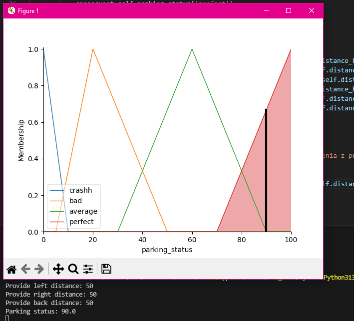

# LAB 2 - PROJEKT

Projekt polega na ocenie jakości parkowania pojazdu na podstawie odległości od przeszkód - z tyłu, prawej i lewej strony. Głównym zadaniem programu jest analiza odległości w celu określenia, czy pojazd zaparkował bezpiecznie, z ryzykiem kolizji, lub czy został zaparkowany idealnie.

Do rozwiązania problemu wykorzystano logikę rozmytą. System posiada cztery poziomy oceny jakości parkowania:

<li> Crash (Kolizja) – odległość od przeszkody jest tak mała, że ryzyko kolizji jest wysokie lub już wystąpiło. </li>
<li> Bad (Zły) – pozycja nie jest optymalna i do kolizji brakuje bardzo mało. </li>
<li> Average (Średni) – parkowanie jest dobre, ale nie idealne. </li>
<li> Perfect (Perfekcyjny) – pojazd znajduje się w idealnej pozycji względem przeszkód, pozostawiając odpowiednią i bezpieczną odległość. </li>

## Aby uruchomić projekt należy:

<li> Pobrać pliki Fuzzy.py oraz requirements.txt. </li>

<li> Zainstalować wymagane biblioteki, korzystając z pliku requirements.txt. W tym celu używając poniższej komendy w terminalu: </li>

pip install -r requirements.txt

Plik requirements.txt zawiera wszystkie potrzebne biblioteki, które są niezbędne do prawidłowego działania gry.

# Przykładowe wywołanie programu:

DLA ZDERZENIA:   

DLA ZŁEJ OCENY:   

DLA OCENY ŚREDNIEJ:   

DLA NAJLEPSZEJ OCENY:   

