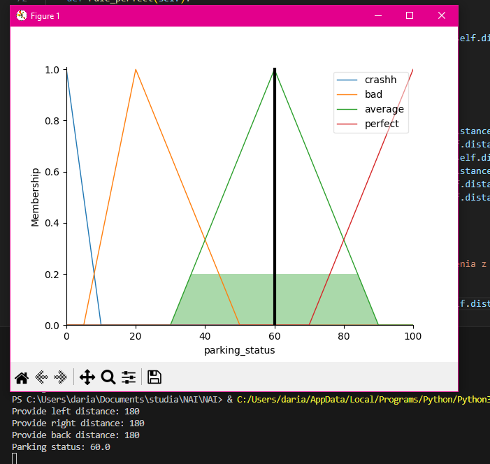

# LAB 2 - PROJEKT

Projekt służy do oceny parkowania auta, na podstawie wykrytych przez czujniki odległości od przeszkód.

## Aby uruchomić projekt należy:

<li> Pobrać pliki Fuzzy.py oraz requirements.txt. </li>

<li> Zainstalować wymagane biblioteki, korzystając z pliku requirements.txt. W tym celu używając poniższej komendy w terminalu: </li>

pip install -r requirements.txt

Plik requirements.txt zawiera wszystkie potrzebne biblioteki, które są niezbędne do prawidłowego działania gry.

# Przykładowe wywołanie programu:

DLA ZDERZENIA:   

DLA ZŁEJ OCENY:   

DLA OCENY ŚREDNIEJ:   

DLA NAJLEPSZEJ OCENY:   

