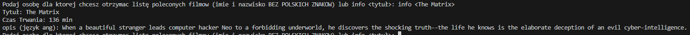

# URUCHOMIENIE
API KEY ZOSTAŁ PODANY MAILOWO!

ABY URUCHOMIĆ PROGRAM NALEŻY:
Pobrać pliki movie_recommendations.py, data.json oraz requirements.txt.
Zainstalować wymagane biblioteki, korzystając z pliku requirements.txt. W tym celu używając poniższej komendy w terminalu:
pip install -r requirements.txt

Plik requirements.txt zawiera wszystkie potrzebne biblioteki, które są niezbędne do prawidłowego działania programu

Do zmiennej api_key przypisać API KEY podany na mailu

# O PROGRAMIE
Projekt polega rekomendacji filmów na podstawie ocen użytkowników, z zastosowaniem algorytmu podobieństwa. Celem jest zaproponowanie użytkownikowi filmów, które mogą go zainteresować oraz tych których powinien unikać na podstawie jego ocen oraz ocen innych użytkowników. Główne działanie projektu to wykorzystanie analizy podobieństwa między użytkownikami do tworzenia rekomendacji.

Program zawiera kilka funkcji - po wpisaniu odpowiednich komend:

1. INPUT: *"Imię Nazwisko"* - (Bez polskich znaków) wypisuje ocenę dopasowania z innymi użytkownikami i na podstawie najlepszego wyniku wypisuje 5 najlepiej ocenionych filmów przez użytkownika.

2. INPUT: *"-h"* - wypisuje nam dostępne w programie komendy

3. INPUT: *"Imię Nazwisko -i"* - podaje nam polecone filmy na podstawie najlepszego dopasowania oraz podstawowe informacje na temat poleconych filmów

4. INPUT: *"Imię Nazwisko -w"* - podaje NIE polecane filmy, których podana osoba powinna unikać

5. INPUT: *"Imię Nazwisko -w-i"* - wyświetla filmy do unikania z dodatkowymi informacjami

6. INPUT: *"info <tytuł>"* - poda informacje o wybranym filmie

7. INPUT: *"-w"* - wychodzi z programu

8. INPUT: *"-i"* - podaje informacje o programie

# PRZYKŁADOWE WYWOŁANIE PROGRAMU

DLA POLECONYCH FILMÓW:   

DLA ANTY-REKOMENDACJI:   

DLA INFORMACJI O POLECONYCH FILMACH:   

DLA INFORMACJI O WYBRANYM FILMIE:   

DLA INFORMACJI O PROJEKCIE:   

DLA POKAZANIA KOMEND:   

#WYKONANIE

Daria Szabłowska s24967
Damian Grzesiak s25866
